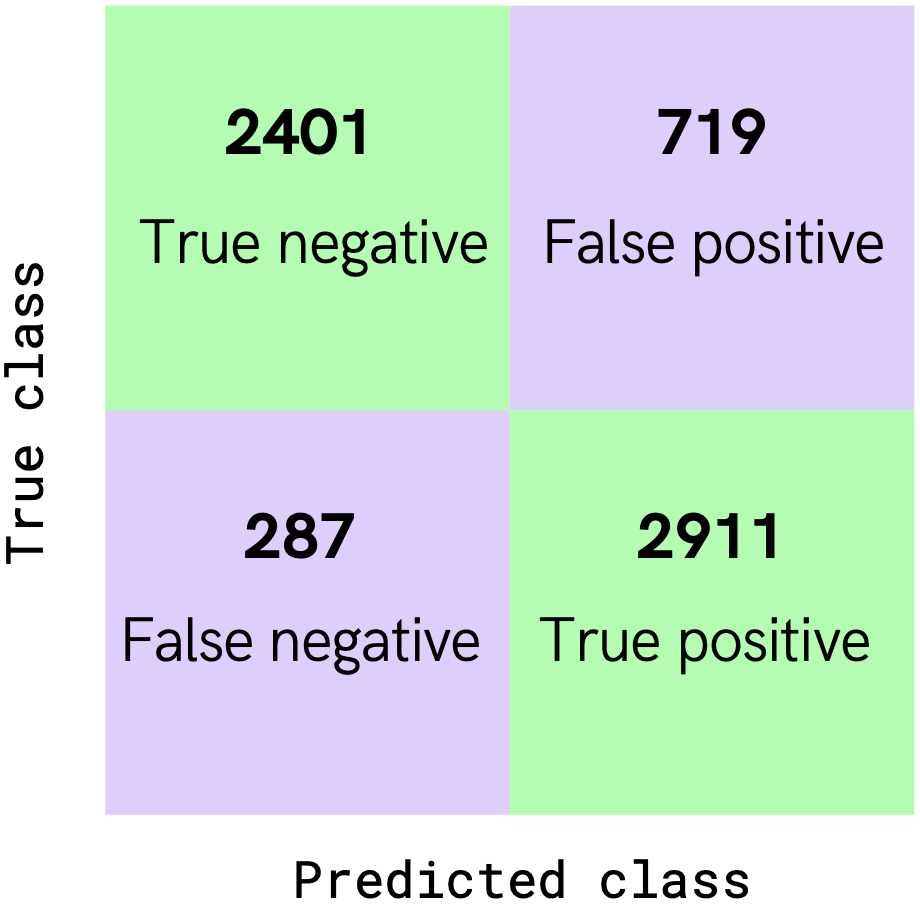
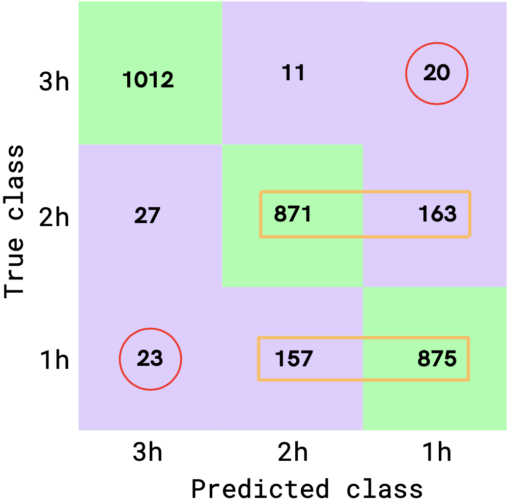
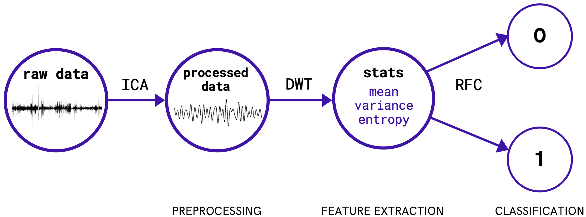

# Safe Seizure - prédire les crises d'épilepsie

**Safe Seizure**: machine learning pour prédire les crises d'épilepsie

*Langage:* Python

<!--more-->

## 1 Problème

L'épilepsie touche 50 millions de personnes sur Terre. Dans 40% des cas, les patient.e.s épileptiques sont insensibles aux traitements anti-convulsifs. 

La capacité de prédire, suffisamment en avance, la prochaine crise d'épilepsie pourrait significativement améliorer le quotidien des patients épileptiques.

## 2 Solution: Safe Seizure

A l'aide du Machine Learning, l'équipe Safe Seizure est capable de prédire la survenue d'une crise d'épilepsie jusqu'à 3 heures à l'avance en utilisant des intracraniaux (iEEGs).

## 3 Objectifs

* **Objectif 1**: Distinguer les phases préictales (i.e. pré-crise) des phases interictales (i.e. sans crise) --> classification binaire

* **Objectif 2**: Pour les phases préictales (i.e. pré-crise), prédire si une crise va survenir dans les 1, 2, ou 3 heures qui suivent --> classification multi-classe

## 4 Résultats

| **Resultats 1**: justesse de **84%** | **Results 2**: justesse de **87%** |
| --- | --- |
|  |  |

Dans les Résultats 2, les classifications incorrectes à absolument minimiser sont entourées en rouge.

Aussi, les rectangles oranges soulignent une certaine confusion entre les classes 2h et 3h avant la prochaine crise.

## 5 Algorithme

L'algorithme de Machine Learning developpé pour le projet est inspiré de [al-Qerem et al. 2020](https://journals.sagepub.com/doi/10.1177/1550147720911009). 

Ci-dessous, l'algorithme séquentiel:

1. Les signaux iEEGs bruts sont **débruités** en utilisant une **Independent Component Analysis** (ICA). 
2. Les signaux débruités sont ensuite **filtrés** en utilisant une **Discrete Wavelet Transform** (DWT).
3. Une série **d'indicateurs statistiques** est extraite des signaux filtrés (moyenne, déviation standard, entropie...)
4. **Classification** à l'aide d'un modèle **Random Forest Classifier** (RFC)

