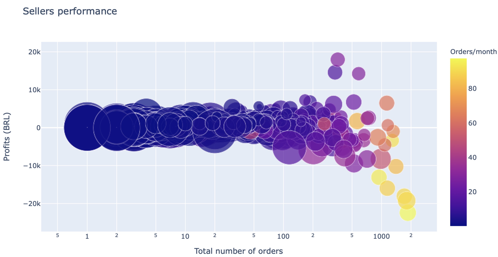
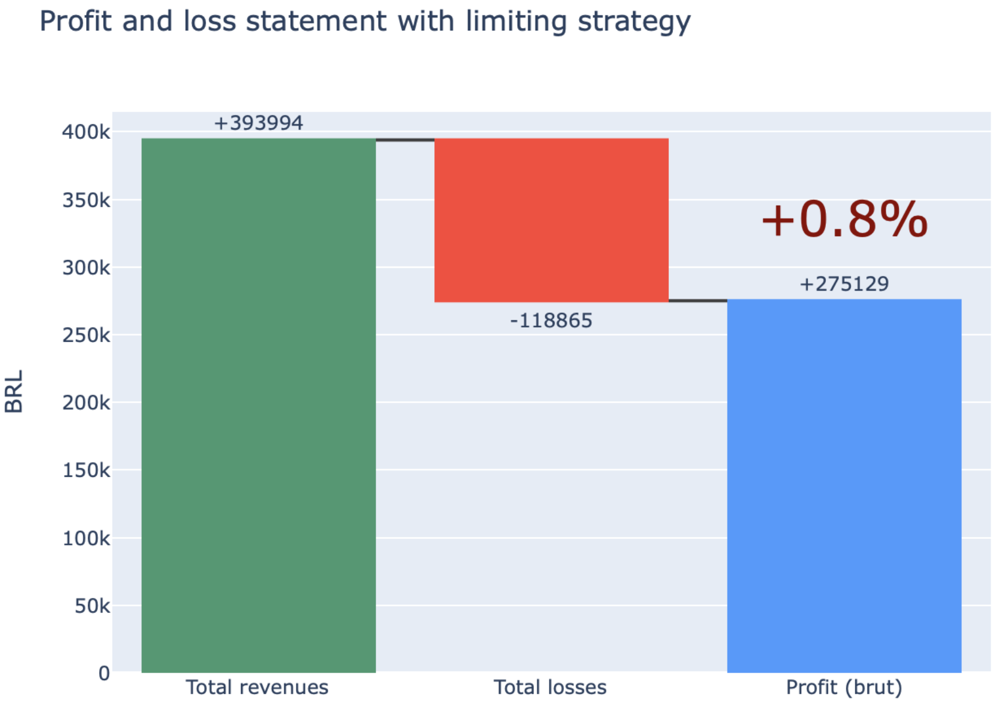
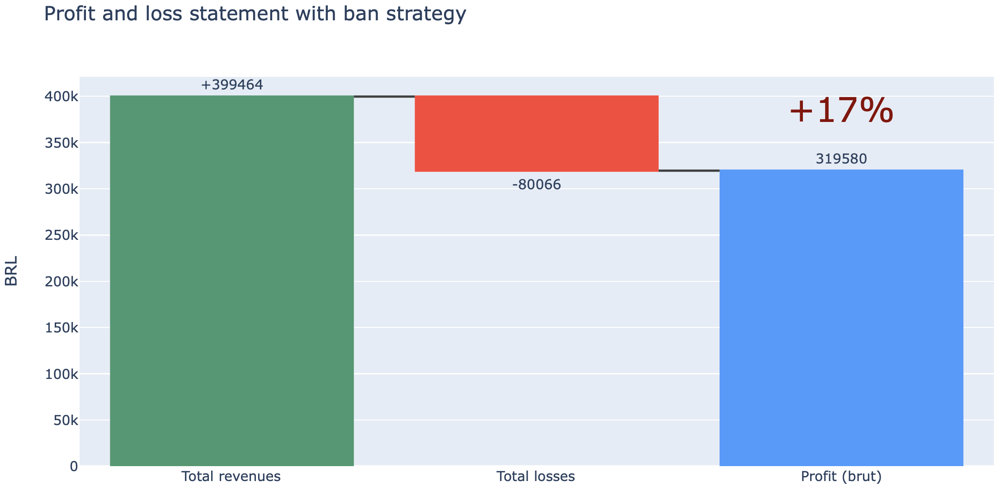

# Olist - e-commerce Brésilien

**Challenge Olist**: durablement accroître les profits du e-commerce!

*Langage:* Python

<!--more-->

## 1 Problème

Comment **accroître** les **profits** mensuels d'Olist tout en maintenant un afflux de commandes **sain**? 

## 2 Solution

Ce projet en **Data Analytics** utilise les données de la plateforme Olist rendues publies sur [Kaggle](https://www.kaggle.com/olistbr/brazilian-ecommerce) afin d'apporter des **solutions** pour **accroître** les profits mensuels d'Olist de manière **saine** et **durable**.

## 3 Objectifs

Pour répondre au problème posé, **deux objectifs** ont été fixé:

1. **Identification** des principales sources de perte
2. **Simulation** de deux solutions pour réduire les pertes identifiées

## 4 Résultats

### 4.1 Identifier les vendeurs les moins performants

Les vendeurs les moins performants ont parmis les plus importants afflux de commandes mensuelles, typiquement supérieurs à 80 commandes/mois.

### 4.2 Solutions pour réduire les pertes

#### **Solution 1:** stratégie de limitation

En limitant les commandes mensuelles à 30 pour les vendeurs ayant plus de 10% de très mauvais avis (1 étoile), les profits mensuels d'Olist augmentent de 0.8%.

**Bénéfices:** 
* aucun vendeur n'est banni de la plateforme --> Olist ne perd pas de clients
* L'impact des "mauvais vendeurs" est réduit d'un facteur 3.5

**Trade-off:**
* Impact plutôt limité: seulement 0.8% de gain de profits

#### **Solution 2:** stratégie de bannissement

En bannissant les plus mauvais vendeurs de la plateforme, les profits mensuels d'Olist augmentent de 17%.

**Bénéfices:** 
* Fort impact: 17% de gain de profits

**Trade-off:**
* Olist perd des clients et des ventes mensuelles
