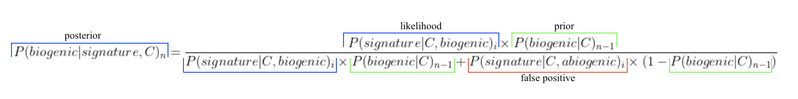
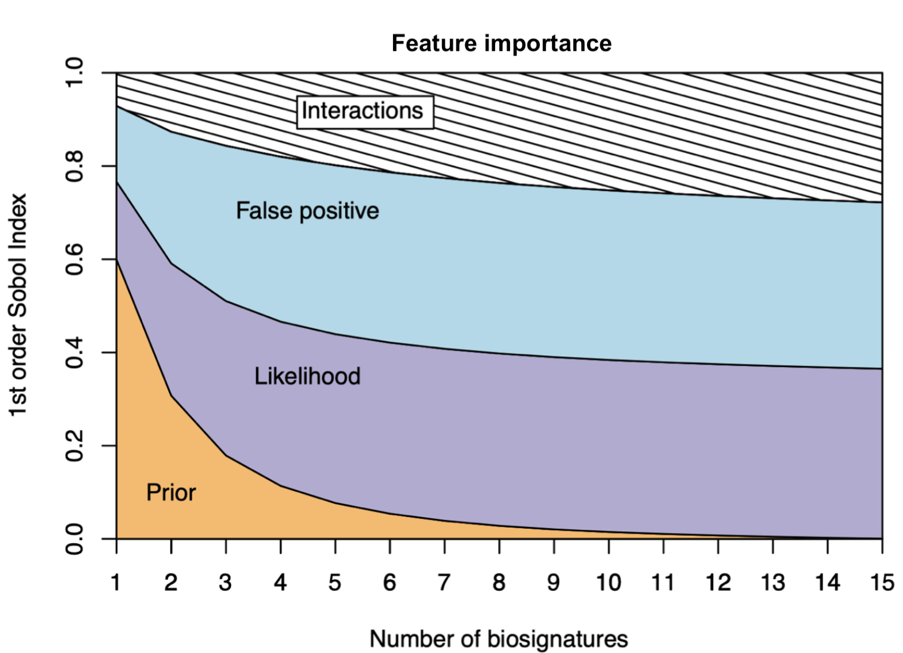

# Recherche de vie extra-terrestre - traces de vie Martiennes (a.k.a. biosignatures)

**Recherche de vie extra-terrestre** - traces de vie Martiennes (a.k.a biosignatures)

*Langage:* R

<!--more-->

## 1 Contexte

Ce projet fait parti de ma thèse de fin de Master sur les traces de vie sur Mars.

La recherche d'une vie extra-terrestre est guidée par l'étude de traces de vie anciennes dans des environnements terrestres dits analogues à la surface de Mars, comme l'Antarctique par exemple. Ces traces de vie, appelées biosignatures, peuvent être préservées parfois pendant plus milliards d'années dans la roche. Il existe de nombreux types de biosignatures, commes les molécules organiques ou les micro-fossiles par exemple. 
Cependant, chaque biosignature a une fiabilité, ainsi qu'un potentiel de préservation dans la roche et de détection différents. De plus, jusqu'à aujourd'hui, aucune biosignature connue n'est une preuve irréfutable d'une vie passée. Ainsi, identifier une vie extraterrestre, actuelle ou passée, nécessite non pas une seule mais plûtot une combinaison de biosignatures de différents types.

* Quel est le nombre optimal de biosignature pour garantir l'identification d'une vie extra-terrestre fiable?
* Est-il préférable de détecter peu de biosignatures à la fiabilité accrue ou un plus grand nombre de biosignatures, plus facile à déétecter, mais à la fiabilité réduite?

## 2 Objectifs

Inspiré par le travail de [Catling et al. 2018](https://www.liebertpub.com/doi/10.1089%2Fast.2017.1737) sur les biosignatures exoplanétaires, ce projet apporte un cadre statistique Bayésien pour la recherche de vie extra-terrestre dans un contexte *in-situ*.

Une fois le modèle formulé, une analyse globale de sensibilité est opérée sur le modèle permettant d'établir des lignes directrices claires pour la suite des recherches astrobiologiques. 

## 3 Résultats

**Modèle Bayesien pour les biosignatures *in-situ*:**

&nbsp;

&nbsp;

* le terme **posterior** est la probabilité que l'échantillon de roche soit biogénique (i.e. d'origine biologique) sachant les (bio)signatures détectées et le contexte géologique de l'échantillon;
* le terme **likelihood** est la probabilité qu'une (bio)signature soit détectée dans l'échantillon s'il est biogénique et sachant son contexte géologique;
* le terme **prior** représente la croyance initiale que l'échantillon de roche soit biogénique sachant son environnement géologique;
* le terme **false positive** est la probabilité qu'une (bio)signature soit détectée dans l'échantillon s'il n'est pas biogénique et sachant son contexte géologique.

&nbsp;

**Analyse de sensibilité globale:**

L'analyse globale de sensibilité a été exécutée grâce à la méthode dite de [Sobol'](https://www.sciencedirect.com/science/article/abs/pii/S0010465598001568) implémentée dans le `R sensitivity package`. Les indices de Sobol' de premier ordre ont été calculés pour le modèle décrit ci-dessous et en fonction du nombre de (bio)signatures détectées (de n = 1 à n= 15).

De la figure ci-dessus sont déduits les points suivants:

* Lorsqu'**une seule** (bio)signature est détectée, l'identification d'une vie extra-terrestre repose essentiellement sur notre compréhension du **contexte géologique** dans lequel l'échantillon a été récolté;
* Lorsque **deux** (bio)signatures sont détectées, l'identification d'une vie extra-terrestre repose équitablement sur notre compréhension (i) du **contexte géologique**, (ii) des **processus biologiques** qui produisent ces (bio)signatures, et (iii) des **processus NON-biologiques** qui produisent ces (bio)signatures; 
* Détecter **sept** (bio)signatures ou plus n'**accroît pas la fiabilité** du diagnostiqu, et ce peu importe le type de biosignature. De plus, l'impact de notre compréhension du **contexte géologique** sur le diagnostique devient **négligeable**.

## 4 References

<ins>Catling</ins>, D. C., Krissansen-Totton, J., Kiang, N. Y., Crisp, D., Robinson, T. D., DasSarma, S., ... & Domagal-Goldman, S. (2018). Exoplanet biosignatures: a framework for their assessment. Astrobiology, 18(6), 709-738.

<ins>Sobol</ins>, I. M., & Levitan, Y. L. (1999). On the use of variance reducing multipliers in Monte Carlo computations of a global sensitivity index. Computer Physics Communications, 117(1), 52-61.

