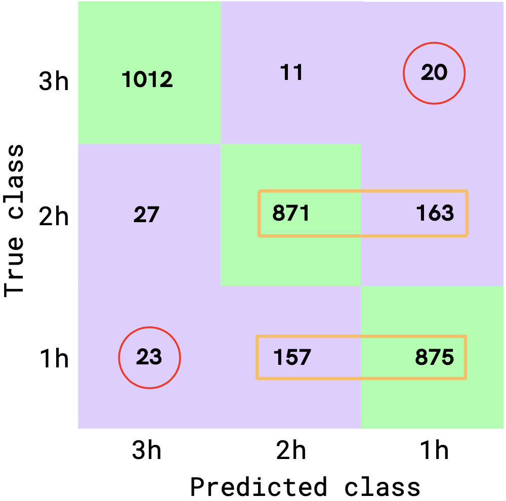

# Safe Seizure - Brain seizure prediction

**Safe Seizure**: Brain seizure prediction using machine learning

*Language:* Python

<!--more-->

## 1 Problem

Around 50 million people on Earth have chronic epilepsy. In about 40% of cases, patients have drug-resistant epilepsy against which anti-seizure treatments have no effect. 

Being able to predict, well in advance, when the next seizure will occur could significantly improve epileptic patients lives.

## 2 Solution: Safe Seizure

Using Machine Learning, the Safe Seizure team is able to predict if a seizure will occur up to 3 hours in advance using intracranial EEGs (iEEGs).

## 3 Objectives

* **Objective 1**: Distinguish preictal (i.e. pre-seizure) from interictal (i.e. no-seizure) states --> binary classification

* **Objective 2**: For preictal (i.e. pre-seizure) states, predict if a seizure will occur in 1, 2, or 3 hours --> multi-class classification

## 4 Results

| **Results 1**: overall accuracy of **84%** | **Results 2**: overall accuracy of **87%** |
| --- | --- |
|  |  |

In Results 2, the mis-classifications that we absolutely want to avoid are circled in red.

Also, in orange rectangles show a confusion between 2 and 3 hours prior to seizure.

## 5 Algorithm

The Machine Learning algorithm developed for the project is inspired by [al-Qerem et al. 2020](https://journals.sagepub.com/doi/10.1177/1550147720911009). 

Below is an outline of the sequential algorithm:

1. The raw iEEG time series are **denoised** using **Independent Component Analysis** (ICA). 
2. The denoised signals are then **filtered** using a **Discrete Wavelet Transform** (DWT).
3. **Statistical indicators** are extracted from the filtered signals (mean, std, entropy, mav...)
4. **Classification** using a **Random Forest Classifier** (RFC)

