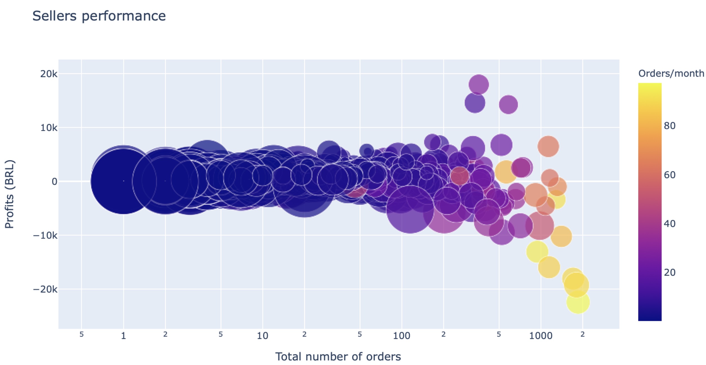
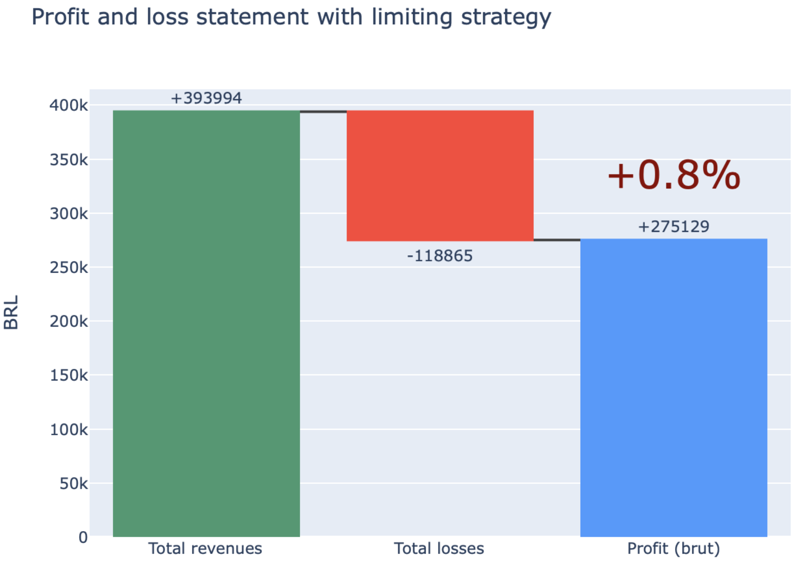
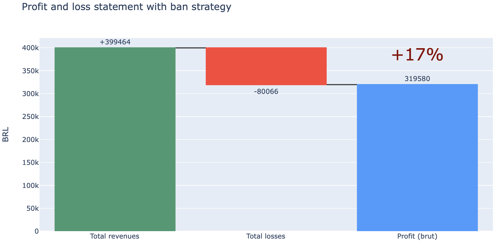

# Olist - Brazilian e-commerce challenge

**Olist challenge**: healthily increase your e-commerce profits!

*Language:* Python

<!--more-->

## 1 Problem

How to **increase** Olist's (Brazil's largest department store) monthly **profits** while maintaining a **healthy** order rate?

## 2 Solution

This **Data Analytics** project makes use of the [Brazilian E-Commerce Public Dataset](https://www.kaggle.com/olistbr/brazilian-ecommerce) to provide **applicable solutions** for increasing Olist's monthly profits in a **healthy** and **sustainable** way.

## 3 Objectives

To address the problem, **two objectives** have been set:

1. **Identification** of the main sources of loss (low-performing sellers)
2. **Simulation** of two loss-reduction solutions

## 4 Results

### 4.1 Identify the worst-performing sellers

The worst-performing sellers have been identified as the sellers with the highest monthly orders, usually with more than 80 orders per month.

### 4.2 Loss-reduction solutions

#### **Solution 1:** limiting strategy

By limiting a seller's number of monthly orders to 30 when their share of 1-star reviews are >10%, Olist's monthly profits sustainably increase by 0.8%. 

**Benefits:** 
* no sellers are banned --> Olist doesn't lose customers
* Reduce "bad sellers" negative impact by 3.5 factor

**Trade-offs:**
* Low impact on monthly profits: only 0.8% increase

#### **Solution 2:** ban strategy

By banning the worst-performing sellers from the online platform, Olist's monthly profits increase by 17%. 

**Benefits:** 
* High impact on monthly profits: 17% profit increase

**Trade-offs:**
* Olist loses customers and monthly orders
