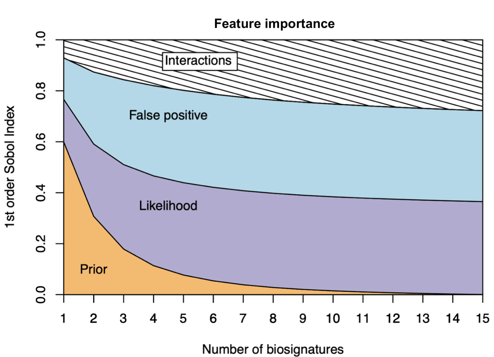

# Search for extraterrestrial life - Martian biosignatures

**Search for extraterrestrial life** - Martian biosignatures (a.k.a. biosignatures)

*Language:* R

<!--more-->

## 1 Background

This project is the statistics chapter of my Master of Research thesis on traces of life on Mars.

The search for life elsewhere is guided by the search for traces of ancient life in environments on Earth that are analoguous to Mars, like Antarctica for example. Such traces, called biosignatures, tend to be preserved in rocks sometimes several billion years old. There are many types of biosignatures, from organic molecules to micro-fossils. 
However, biosignatures are not equally reliable, detectable, and preserved in rocks. Also, there is no known biosignature that is a definite proof of life. Rather, identifying life, past or current, will most likely rely on a combination of various biosignatures.  

* What is the optimal number of biosigantures needed to identify life?
* Is it better to detect more biosignatures that are easy to detect or fewer but more reliable?

## 2 Objectives

Based on [Catling et al. 2018](https://www.liebertpub.com/doi/10.1089%2Fast.2017.1737) on exoplanet biosignatures, this project provides a Bayesian framework for in-situ biosignatures. 

A variance-based sensitivity analysis is then performed on the Bayesian model providing general guidelines for astrobiology strategies.

## 3 Results

**Bayesian model for in-situ biosignatures:**

&nbsp;

&nbsp;

* the **posterior** term is the probability for a rock sample to be biogenic given the signatures detected within it and its environment geological environment;
* the **likelihood** term is the probability of a signature to be detected within the rock if it is biogenic and given the geological environment;
* the **prior** term is the initial belief that the rock is biogenic given its geological environment;
* the **false positive** term is the probability of a signature to be detected if the sample is NOT biogenic and given the geological context.

&nbsp;

**Variance-based sensitivity analysis:**

The sensitivity analysis was performed using the [Sobol' method](https://www.sciencedirect.com/science/article/abs/pii/S0010465598001568) from the `R sensitivity package`. The 1st order Sobol' indices were computed for the Bayesian model described above for up to 15 biosignatures (i.e. 15 iterations, n = 15).

From the figure above, we can infer the following:

* When detecting a **single** biosignature, it is most important to have a deep understanding of the **geological context**; 
* When detecting **two** biosignatures, it is equally important to have a deep understanding of (i) the **geological context**, (ii) the **processes** that produce the biosignatures, and (iii) the processes that produce **similar but non-diagnostic of life**; 
* Detecting **seven** biosignatures or more **does not help** identifying life, and our understanding of the geological environment is **negligible**. 

## 4 References

<ins>Catling</ins>, D. C., Krissansen-Totton, J., Kiang, N. Y., Crisp, D., Robinson, T. D., DasSarma, S., ... & Domagal-Goldman, S. (2018). Exoplanet biosignatures: a framework for their assessment. Astrobiology, 18(6), 709-738.

<ins>Sobol</ins>, I. M., & Levitan, Y. L. (1999). On the use of variance reducing multipliers in Monte Carlo computations of a global sensitivity index. Computer Physics Communications, 117(1), 52-61.

